## Objetivo

Este Roteiro tem o objetivo a documentação e implementação de conceitos sobre uma plataforma de gerenciamento de hardware


### Tarefa 1

### 1. Verificar se está funcionando e se o status está ativo.


### 2.Verificar acessibilidade na própria máquina: 

Foi executado o seguinte comando 
``` bash
 psql -U cloud -h 172.16.0.4 tasks
```
psql: Inicia o cliente interativo do PostgreSQL.

-U cloud: Específica o usuário do banco de dados, que no caso é cloud.

-h 172.16.0.4: Define o host (endereço IP) do servidor PostgreSQL ao qual você deseja se conectar. Neste caso, a conexão será feita para o IP 172.16.0.4, que pode ser um outro servidor na rede ou até mesmo o próprio servidor se esse for o IP dele.

tasks: Define o nome do banco de dados ao qual o usuário cloud tentará se conectar.

Esse código foi executado dentro do Server1.
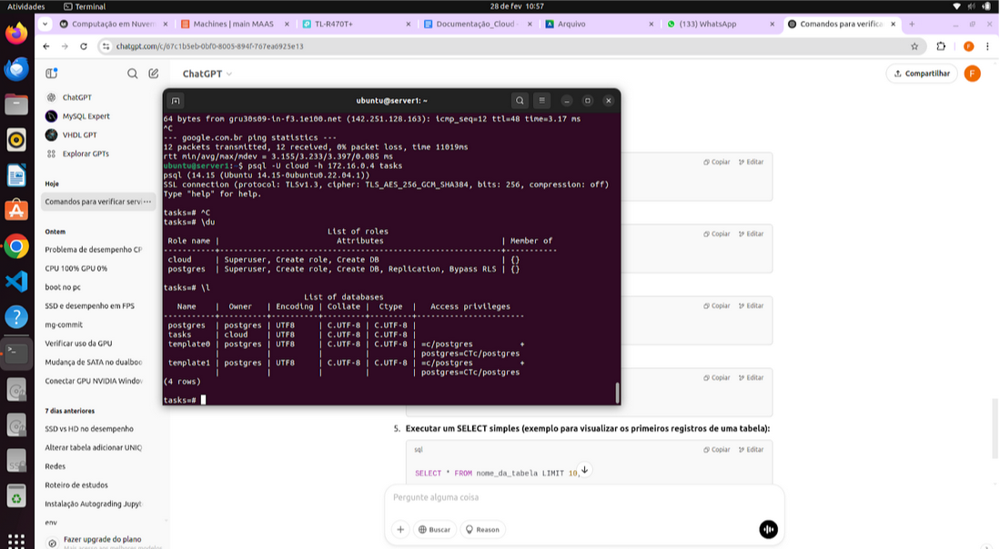


### 3. Acessibilidade a partir da máquina main: 
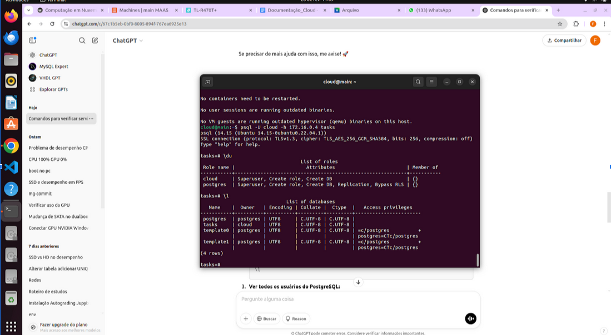
 
Usando o mesmo comando para verificar a conexão interna, porém agora a partir da minha máquina main. 
Instalamos o client na main usando o comando:
``` bash
sudo apt update && sudo apt install postgresql-client -y
```

### 4. Porta em que o serviço está funcionando:

 
Ao executar o nmap. Foi conferido que o serviço está rodando na porta 5432:
5432/tcp open postgresql


### Tarefa 2

### 1.Do Dashboard do **MAAS** com as máquinas.


### 2.Da aba de imagens, com as imagens sincronizadas


### 3. Testes de Hardware para cada máquina
### máquina 1:

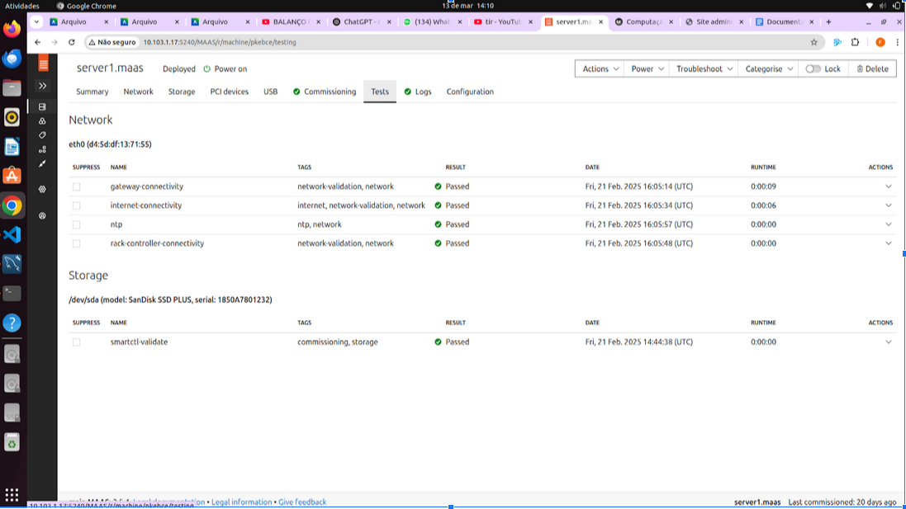

### máquina 2:
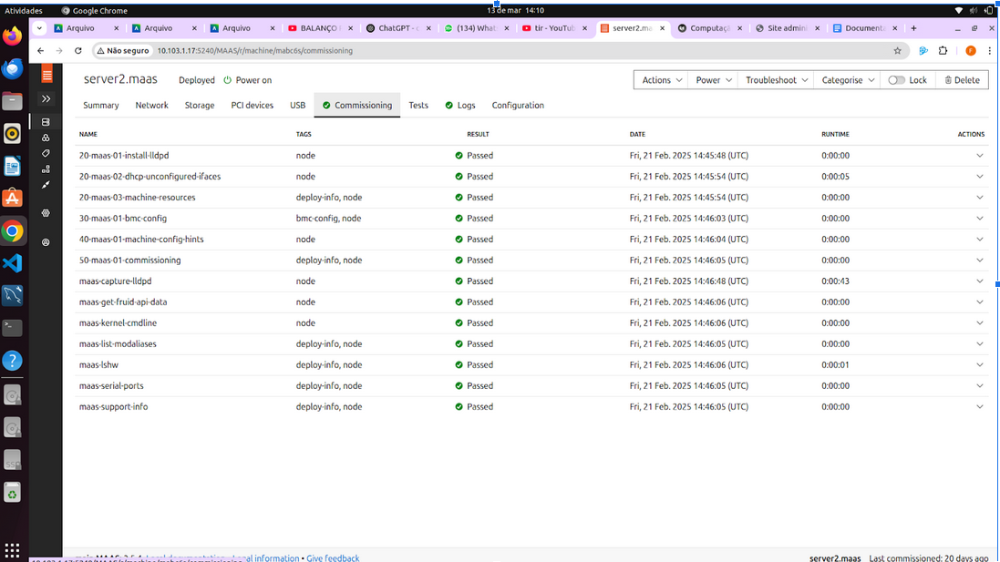
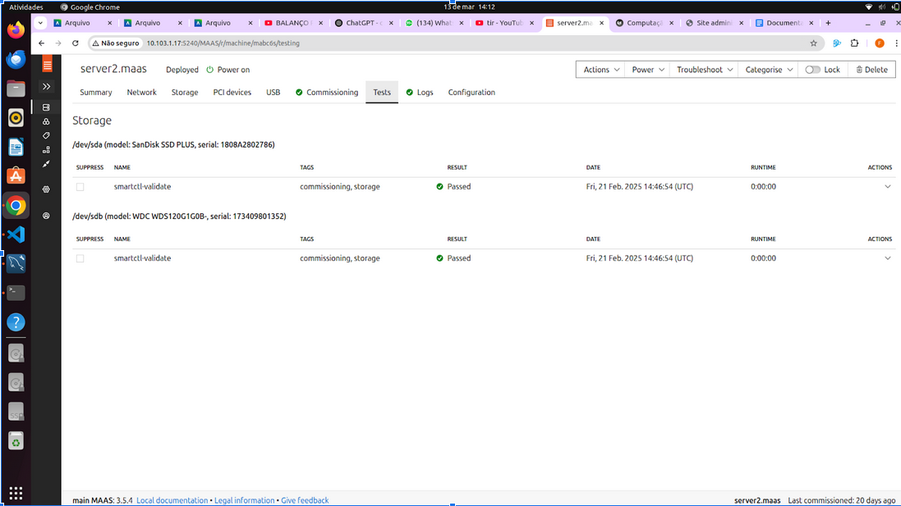

### máquina 3:


### máquina 4:
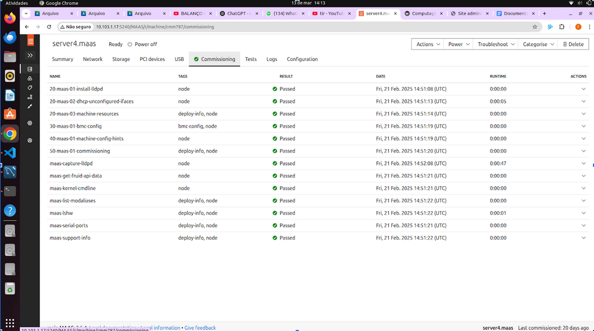
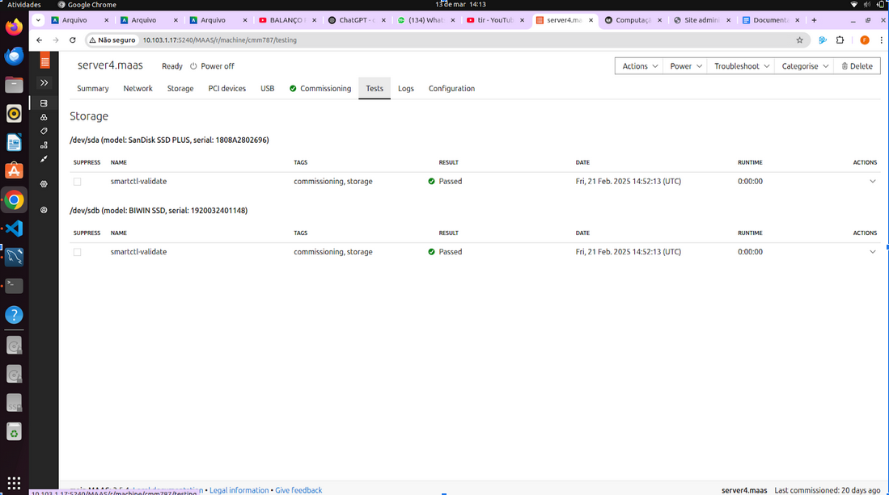

### máquina 5:
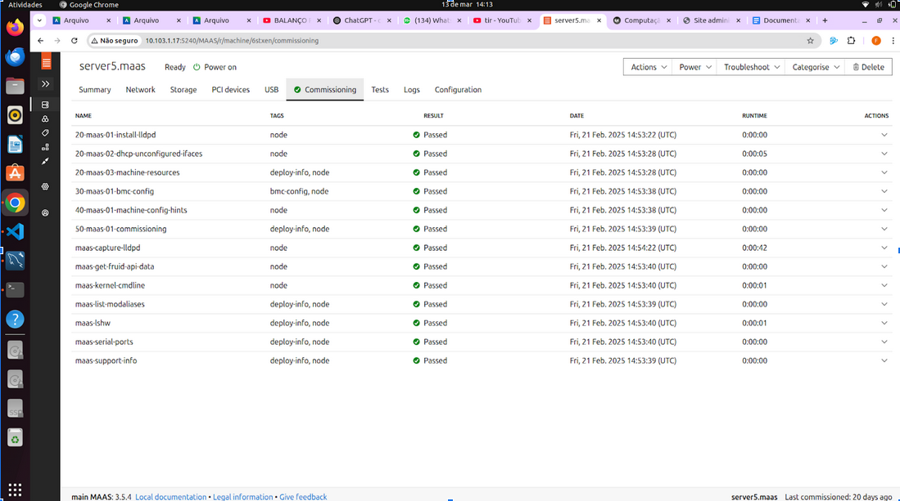
  

### Tarefa 3

### 1.máquinas e respectivos IPs
  

### 2.Aplicação Django
  

### 3.Explicação da aplicação manual do Django:
 
a. Deploy feito pelo dashboard do maas - deploy por linha de comando não estava funcionando

b. No ssh do server2 foi clonado o seguinte repositório: 
``` bash
git clone https://github.com/raulikeda/tasks.git
```
c. dentro do diretorio tasks. Foi feita a instalação
``` bash
./install.sh 
```
d. reboot do server2
``` bash
sudo reboot
```
e. testando o acesso:
``` bash
wget http://[172.16.0.9]:8080/admin/
```
f. Ao testar o acesso obtivemos erros de conexão:

mudança no etc/hosts

172.16.0.4 server1 (onde estava instalado o postgres)

g. Tunel ssh:

conectanmos no maas utilizando: 
``` bash
ssh cloud@10.103.0.X -L 8001:[172.16.0.9]:8080
```
h. acesso no django feito: 

user: cloud

senha: cloud

### Tarefa 4

### 1. De um print da tela do Dashboard do MAAS com as 3 Maquinas e seus respectivos IPs.
  

### 2.De um print da aplicacao Django, provando que voce está conectado ao server2 
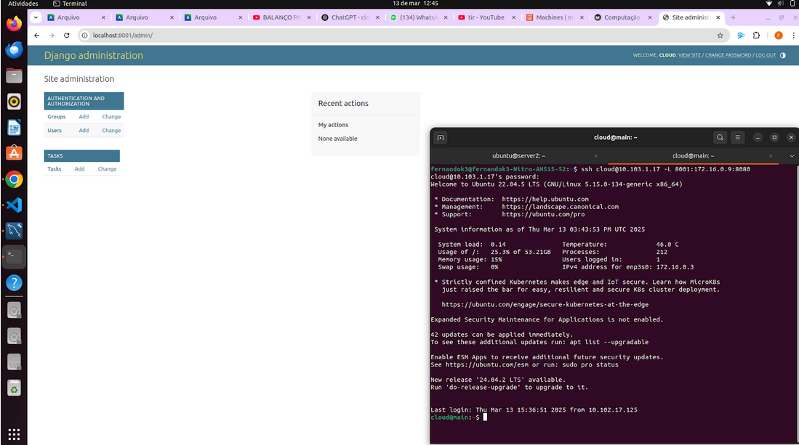  

### 3.De um print da aplicacao Django, provando que voce está conectado ao server3 
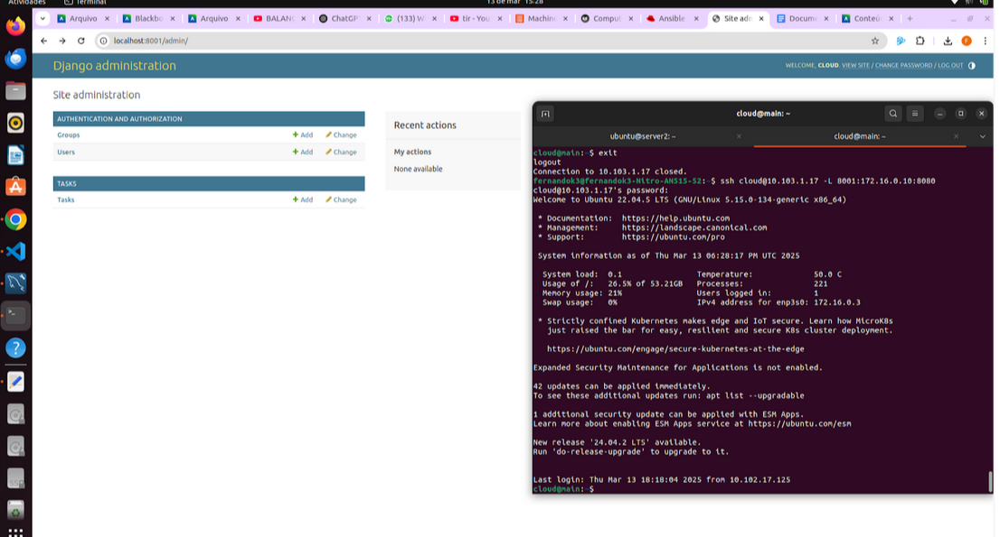  

### 4. Explique qual diferenca entre instalar manualmente a aplicacao Django e utilizando o Ansible.
Com o Ansible, a instalação é automatizada por meio de playbooks, garantindo consistência, rapidez e escalabilidade, ideal para múltiplos servidores. Enquanto a abordagem manual oferece mais controle ela exige uma instalação para cada máquina tornando-o menos escalável.

### Tarefa 5.

### 1. De um print da tela do Dashboard do MAAS com as 4 Maquinas e seus respectivos IPs.
  

### 2.Altere o conteúdo da mensagem contida na função `index` do arquivo `tasks/views.py` de cada server para distinguir ambos os servers.
server 2:
  

server 3: 
  

### 3.Faça um `GET request` para o path que voce criou em urls.py para o Nginx e tire 2 prints das respostas de cada request, provando que voce está conectado ao server 4, que é o Proxy Reverso e que ele bate cada vez em um server diferente server2 e server3.
Criando o tunel: 
  

Forçando o django a rodar na porta 8000 do server2:
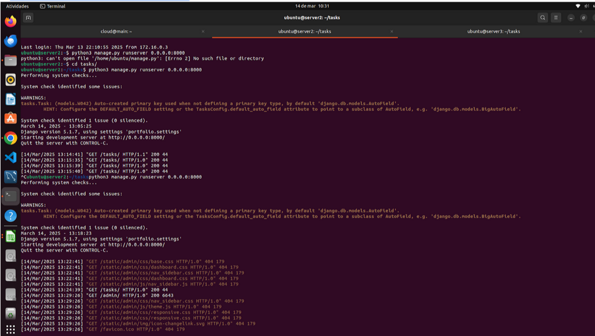  

Forçando o django a rodar na porta 8000 do server3:
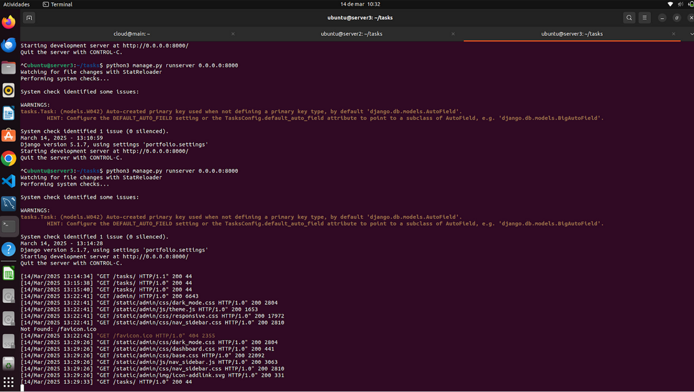  

Acessando os servers via localhost de um browser
server 2:
  

server 3:
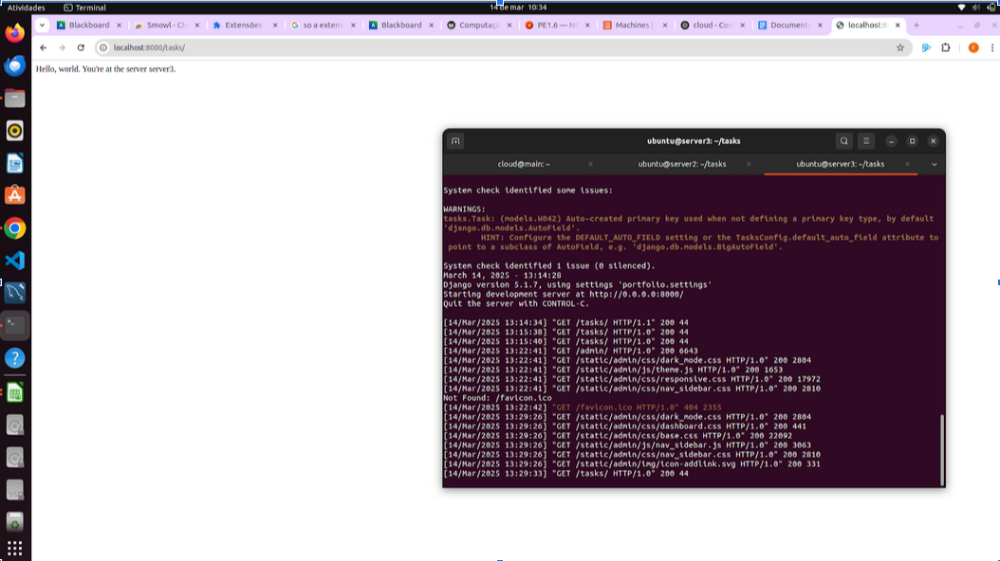  

## Discussões

A instalação manual do PostgreSQL e Django foi direta, assim como o uso do SSH e MaaS CLI, facilitando o deploy inicial. No entanto, configurar DHCP, DNS e firewall exigiu atenção para garantir conectividade. O balanceamento de carga com Nginx foi desafiador, demandando ajustes nas regras de roteamento. Ferramentas como Ansible simplificaram o processo, tornando a implantação mais eficiente.

## Conclusão

A instalação manual ajudou a entender cada parte do processo, mas exigiu mais tempo e cuidado com detalhes. O Ansible simplificou o deploy, tornando-o repetível e confiável. O MaaS facilitou o gerenciamento das máquinas, mas configurar rede e balanceamento de carga exigiu mais testes e ajustes.
